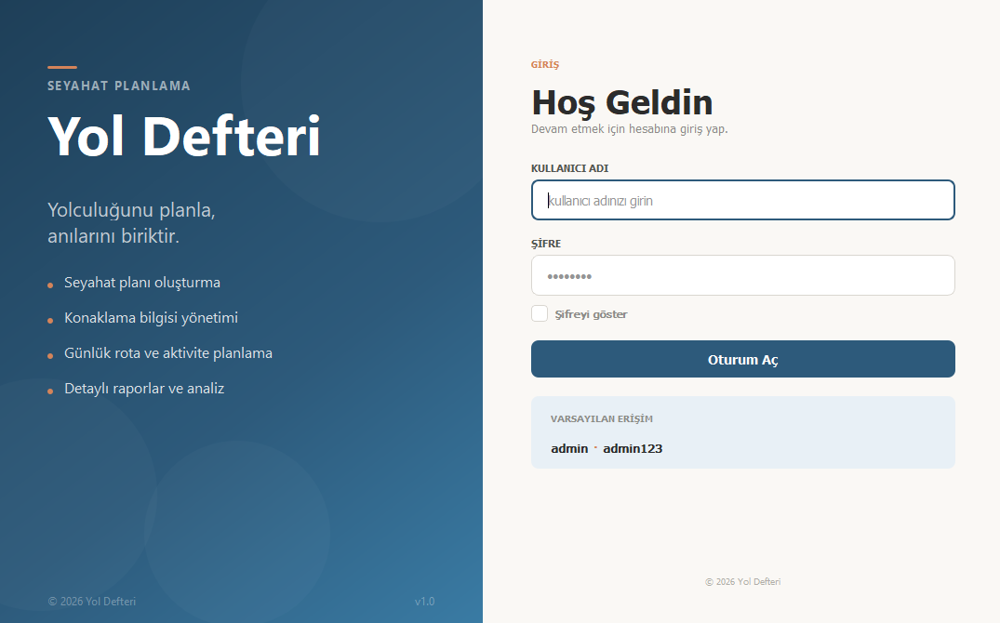
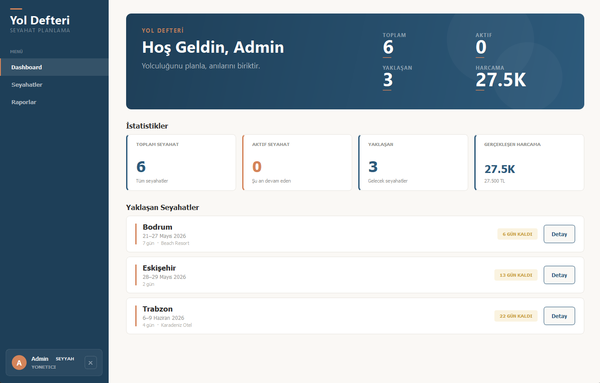
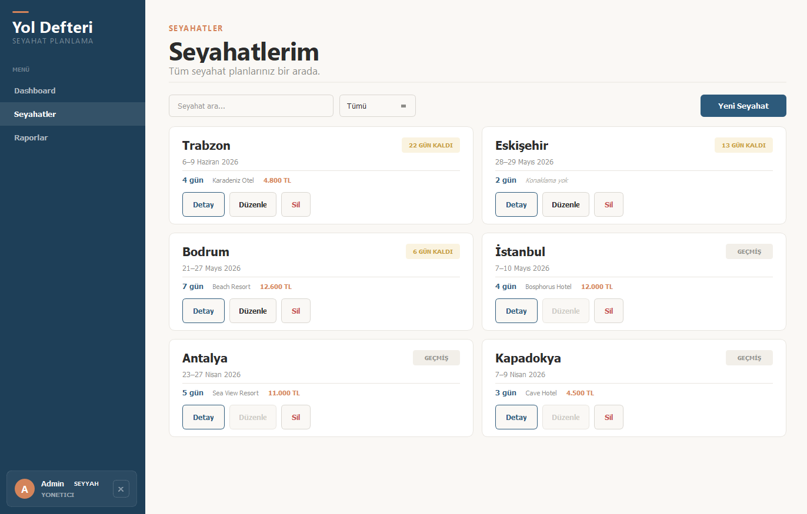
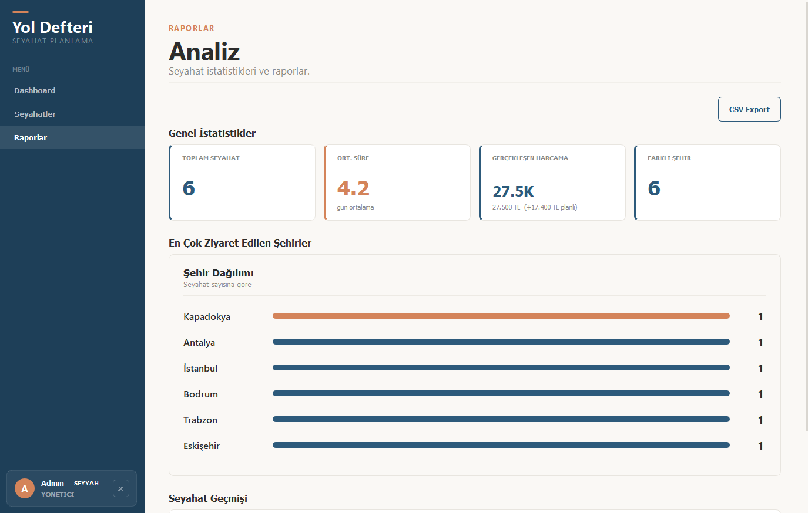

# Yol Defteri - Seyahat Planlama Uygulamasi

Seyahat planlari olusturma, konaklama bilgilerini yonetme ve gunluk rota ile aktiviteleri planlama icin gelistirilmis masaustu uygulamasidir. PyQt5 ile Atlas temasinda modern bir arayuz sunar.

## Teknolojiler

- **Python 3.10+** - Programlama dili
- **PyQt5 (>=5.15.0)** - Masaustu GUI framework
- **JSON** - Veri kaliciligi
- **PBKDF2-HMAC-SHA256** - Sifre guvenligi

## Proje Yapisi

    seyehat planlama/
    ├── main.py                          # Ana giris noktasi
    ├── requirements.txt                 # Bagimliliklar
    ├── fix.py                          # CSS temizleme scripti
    ├── data/
    │   ├── seyahatler.json             # Seyahat verileri (nested yapi)
    │   └── kullanicilar.json           # Kullanici kimlik bilgileri
    ├── backend/
    │   ├── seyahat.py                  # Seyahat sinifi
    │   ├── konaklama.py                # Konaklama sinifi
    │   ├── plan.py                     # Gunluk Plan sinifi
    │   ├── kullanici.py                # Kullanici sinifi
    │   ├── auth.py                     # Kimlik dogrulama
    │   ├── veri_yoneticisi.py          # JSON veri yonetimi
    │   └── seed.py                     # Ornek veri yukleme
    ├── images/                          # Ekran goruntuleri
    └── frontend/
        ├── ana_pencere.py              # Ana pencere
        ├── login.py                    # Giris ekrani
        ├── tema.py                     # Atlas temasi
        ├── views/
        │   ├── dashboard.py            # Metrikler + yaklasan seyahatler
        │   ├── seyahatler.py           # Seyahat listesi (kart grid)
        │   ├── seyahat_detay.py        # Tek seyahat detayi
        │   └── raporlar.py             # Istatistikler ve CSV export
        └── widgets/
            ├── bilesenler.py           # Ortak UI bilesenleri
            └── diyaloglar.py           # Modal diyaloglar

## Ana Siniflar

### Seyahat (`backend/seyahat.py`)

- **Ozellikler:** `seyahat_id`, `gidis_yeri`, `tarih`, `donus_tarihi`, `kullanici_id`, `konaklama`, `planlar`, `notlar`
- **Metodlar:** `gun_sayisi()`, `toplam_butce()`, `aktif_mi()`, `gelecek_mi()`, `gecmis_mi()`, `kalan_gun()`, `durum_metni()`, `planlari_olustur()`

### Konaklama (`backend/konaklama.py`)

- **Ozellikler:** `otel_adi`, `fiyat` (gecelik TL), `adres`, `oda_tipi` (Tek Kisilik/Cift Kisilik/Suite)
- **Metodlar:** `toplam_fiyat(gun_sayisi)`

### Plan (`backend/plan.py`)

- **Ozellikler:** `gun`, `tarih`, `rota` (gezilecek yerler listesi), `aktiviteler` (yapilacaklar listesi)
- **Metodlar:** `rota_ekle()`, `rota_sil()`, `aktivite_ekle()`, `aktivite_sil()`

## Ozellikler

- **Dashboard:** 4 metrik (Toplam Seyahat, Aktif, Yaklasan, Toplam Harcama) + yaklasan seyahat kartlari
- **Seyahat Yonetimi:** Kart grid gorunumu, arama, durum filtresi (Tumu/Aktif/Yaklasan/Gecmis), CRUD
- **Seyahat Detay:** Konaklama bilgileri, gunluk plan kartlari (rota + aktiviteler), duzenleme
- **Raporlar:** En cok gidilen sehirler (bar chart), ortalama sure, toplam harcama, CSV export
- **Is Kurallari:** Donus tarihi >= gidis tarihi, gecmis seyahatler duzenlenemez, konaklama opsiyonel (gunubirlik)
- **Otomatik Plan Olusturma:** Yeni seyahatte gun sayisi kadar bos plan nesnesi olusturulur
- **Tasarim:** Atlas temasi - sicak krem (#faf8f5), okyanus mavisi (#2d5a7b), terrakotta accent (#d4845a)

## Ekran Goruntuleri

### Giris Ekrani

### Dashboard

### Seyahatlerim

### Analiz

## Kurulum ve Calistirma

    pip install -r requirements.txt
    python main.py

## Varsayilan Giris

- **Kullanici adi:** `admin`
- **Sifre:** `admin123`

## Ornek Veri

Ilk calistirmada 6 ornek seyahat olusturulur: Kapadokya, Antalya, Istanbul, Bodrum, Trabzon, Eskisehir.
